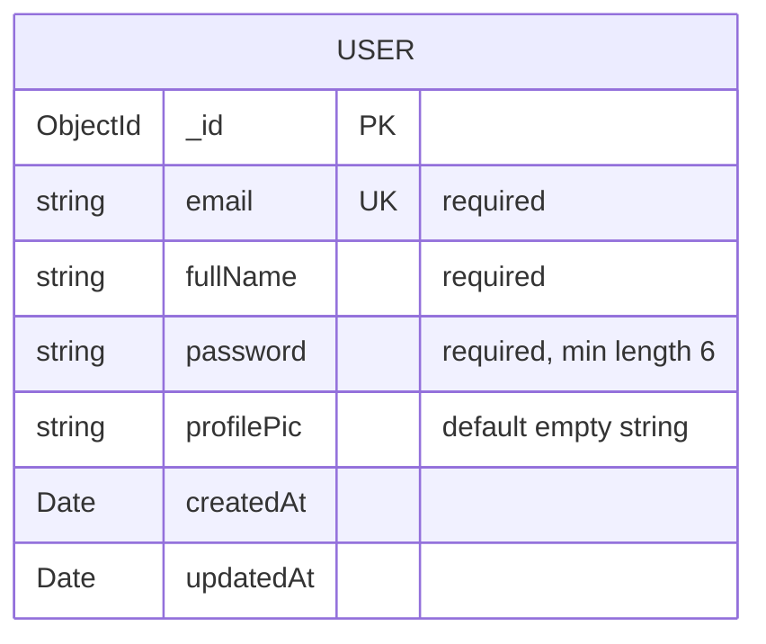
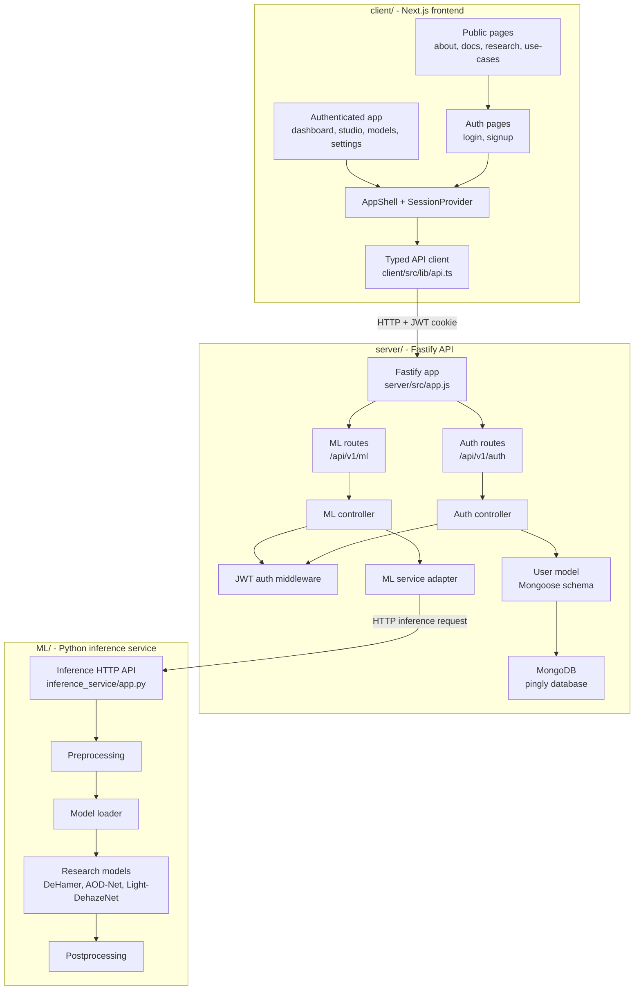
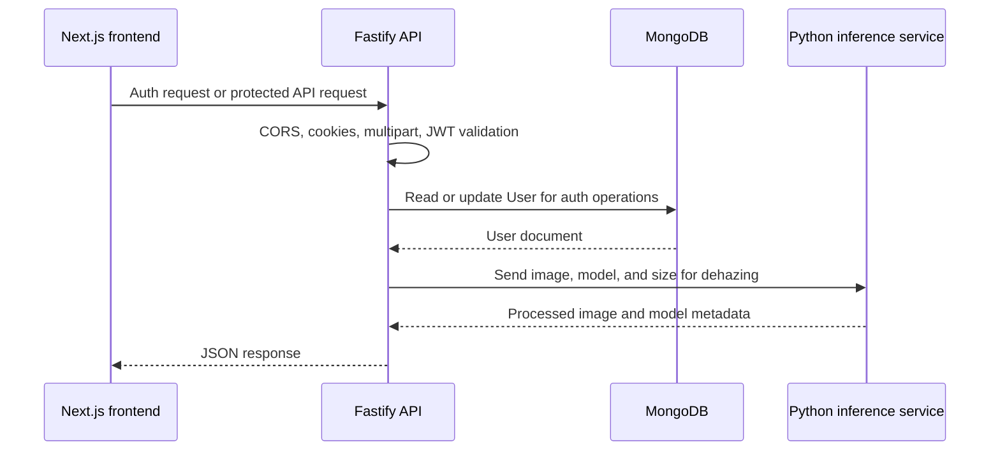

# Entity-Relationship Diagram

The current application database is MongoDB, using the `pingly` database. Based on the implemented Mongoose schemas, the only persisted entity is `User`.

## Entity Details

### `User`

Stored by `server/src/models/user.model.js`.

- `_id`: MongoDB-generated primary key.
- `email`: required and unique.
- `fullName`: required.
- `password`: required, with a minimum length of six characters. The application should store this as a password hash rather than plaintext.
- `profilePic`: optional string, defaulting to an empty string.
- `createdAt` and `updatedAt`: automatically generated by Mongoose timestamps.

## Relationships

No persisted relationships are currently defined. The ML model catalog, uploaded images, dehazing requests, and inference results are handled by the inference service and API request/response flow; they do not currently have MongoDB schemas or foreign-key relationships in this codebase.

## Project Structure

The project is organized as a Next.js frontend, a Fastify API server, and a Python inference service. The following diagram shows the main ownership boundaries and dependencies.

## Runtime Request Flow

The ML catalog and dehazing results remain runtime data. They are not represented as database entities until corresponding persistence models are added.
