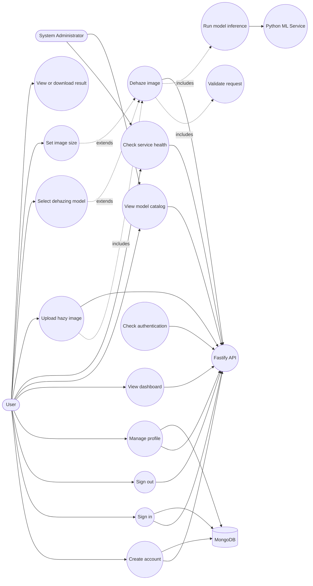
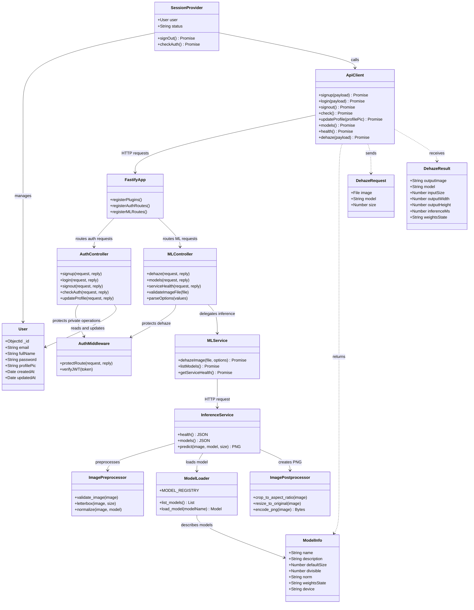
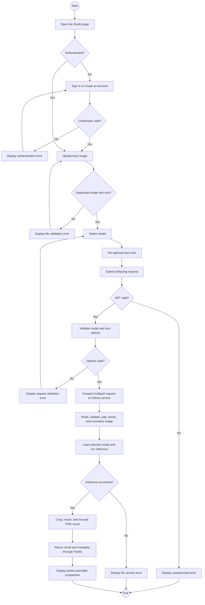

# UML Diagrams - Image De-hazing Platform

This document describes the main user interactions, software classes, and image de-hazing workflow implemented by the project.

## 1. Use Case Diagram

### Use Case Scenarios

#### UC-01: Create Account

| Item             | Description                                                                                                                                                                                                                                                                                    |
| ---------------- | ---------------------------------------------------------------------------------------------------------------------------------------------------------------------------------------------------------------------------------------------------------------------------------------------- |
| Primary actor    | User                                                                                                                                                                                                                                                                                           |
| Preconditions    | The user is not signed in and has a valid email address.                                                                                                                                                                                                                                       |
| Main flow        | 1. The user opens the signup page. 2. The user enters full name, email, and password. 3. The frontend sends `POST /api/v1/auth/signup`. 4. The API validates the data and checks email uniqueness. 5. The user record is stored in MongoDB. 6. The API returns an authenticated user response. |
| Alternative flow | If the email already exists or the data is invalid, the API returns an error and the user remains on the signup page.                                                                                                                                                                          |
| Postconditions   | A new user account exists and the session cookie is available.                                                                                                                                                                                                                                 |

#### UC-02: Sign In

| Item             | Description                                                                                                                                                                                                                                                 |
| ---------------- | ----------------------------------------------------------------------------------------------------------------------------------------------------------------------------------------------------------------------------------------------------------- |
| Primary actor    | User                                                                                                                                                                                                                                                        |
| Preconditions    | A registered user account exists.                                                                                                                                                                                                                           |
| Main flow        | 1. The user enters email and password. 2. The frontend sends `POST /api/v1/auth/login`. 3. The API loads the user from MongoDB. 4. The password is verified. 5. A JWT session cookie is issued. 6. The user is redirected to the authenticated application. |
| Alternative flow | Invalid credentials produce an authentication error without creating a session.                                                                                                                                                                             |
| Postconditions   | The user is authenticated and can access protected routes.                                                                                                                                                                                                  |

#### UC-03: Dehaze Image

| Item              | Description                                                                                                                                                                                                                                                                                                                                                                                                                                                                                                                                                                            |
| ----------------- | -------------------------------------------------------------------------------------------------------------------------------------------------------------------------------------------------------------------------------------------------------------------------------------------------------------------------------------------------------------------------------------------------------------------------------------------------------------------------------------------------------------------------------------------------------------------------------------- |
| Primary actor     | Authenticated user                                                                                                                                                                                                                                                                                                                                                                                                                                                                                                                                                                     |
| Supporting actors | Fastify API and Python ML service                                                                                                                                                                                                                                                                                                                                                                                                                                                                                                                                                      |
| Preconditions     | The user is authenticated and has a supported image file.                                                                                                                                                                                                                                                                                                                                                                                                                                                                                                                              |
| Main flow         | 1. The user opens Studio. 2. The user uploads a hazy image. 3. The user selects a model and optional size. 4. The frontend sends a multipart request to `POST /api/v1/ml/dehaze`. 5. JWT middleware verifies the session. 6. The controller validates file type, file size, model, and image size. 7. The ML service adapter forwards the request to `POST /predict`. 8. The Python service preprocesses the image and runs inference. 9. The result is postprocessed into a PNG. 10. The API returns the result as a data URL. 11. The frontend displays the before-and-after result. |
| Alternative flow  | Missing files, unsupported formats, invalid model settings, service timeouts, and inference failures return suitable errors for the frontend to display.                                                                                                                                                                                                                                                                                                                                                                                                                               |
| Postconditions    | The user receives a dehazed image. The request is not persisted as a database record.                                                                                                                                                                                                                                                                                                                                                                                                                                                                                                  |

#### UC-04: View Model Catalog and Health

| Item             | Description                                                                                                                                                                                                                                                                                              |
| ---------------- | -------------------------------------------------------------------------------------------------------------------------------------------------------------------------------------------------------------------------------------------------------------------------------------------------------- |
| Primary actor    | User or System Administrator                                                                                                                                                                                                                                                                             |
| Preconditions    | The frontend can reach the Fastify API.                                                                                                                                                                                                                                                                  |
| Main flow        | 1. The frontend requests `GET /api/v1/ml/models` and `GET /api/v1/ml/health`. 2. Fastify forwards the requests to the Python service. 3. The service returns supported models and health metadata. 4. The frontend displays model descriptions, default sizes, device, weight state, and service status. |
| Alternative flow | If the service is unavailable, the frontend displays an offline notice and allows retrying.                                                                                                                                                                                                              |
| Postconditions   | The current inference-service state is visible to the user.                                                                                                                                                                                                                                              |

## 2. Class Diagram

## 3. Activity Diagram

The following activity diagram represents the authenticated image de-hazing workflow.

## System Boundaries

- The Next.js frontend is responsible for navigation, forms, upload controls, session state, and result presentation.
- The Fastify server is responsible for authentication, validation, routing, API response shaping, and communication with MongoDB and the ML service.
- MongoDB currently persists user accounts only.
- The Python FastAPI service is responsible for preprocessing, model loading, inference, and image postprocessing.
- Dehazing requests and output images are currently returned through the request/response flow and are not persisted.
